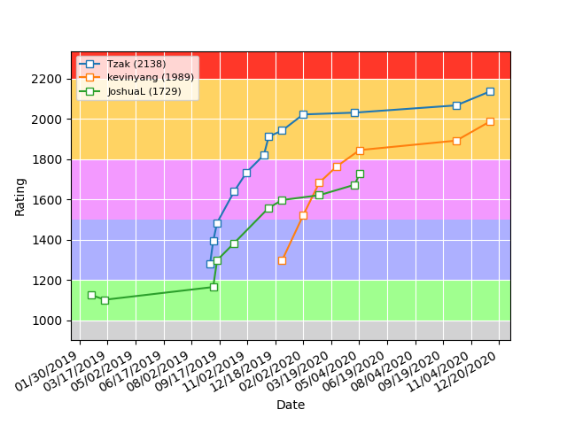

# dmoj-rating-plot

Small script written in Python 3 that uses the [DMOJ API](https://dmoj.ca/post/32-dmoj-api) to plot the ratings of users.

## How to use

Call `python3 rating.py` in its directory, and pass handles as command line arguments

## Example usage

`$ python3 rating.py Tzak kevinyang JoshuaL`

